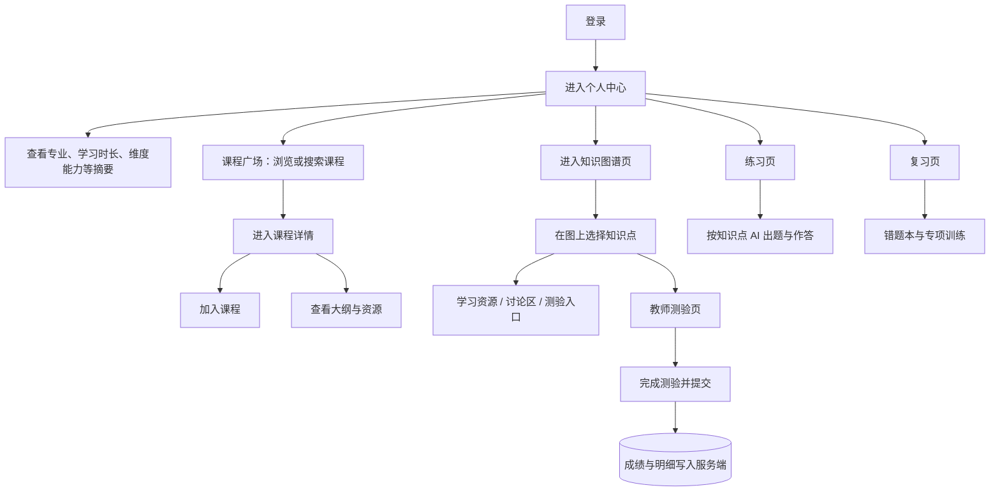
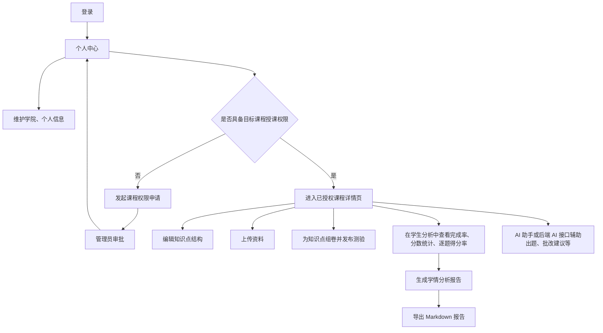
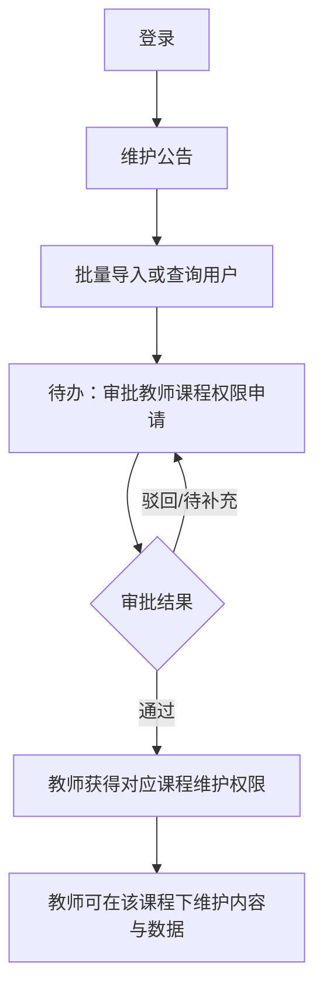

# 三端典型流程（Mermaid）

以下每个代码块可单独复制到 [Mermaid Live](https://mermaid.live) 渲染；也可用于文档或 `mmdc` 导出 PNG。

---

## 6.x.1 学生端典型流程

```mermaid
flowchart TD
  A[登录] --> B[进入个人中心]
  B --> B1[查看专业、学习时长、维度能力等摘要]

  B --> C[课程广场：浏览或搜索课程]
  C --> D[进入课程详情]
  D --> D1[加入课程]
  D --> D2[查看大纲与资源]

  B --> E[进入知识图谱页]
  E --> E1[在图上选择知识点]
  E1 --> E2[学习资源 / 讨论区 / 测验入口]

  B --> F[练习页]
  F --> F1[按知识点 AI 出题与作答]

  B --> G[复习页]
  G --> G1[错题本与专项训练]

  E1 --> H[教师测验页]
  H --> H1[完成测验并提交]
  H1 --> H2[(成绩与明细写入服务端)]
```

---

## 6.x.2 教师端典型流程

```mermaid
flowchart TD
  T0[登录] --> T1[个人中心]
  T1 --> T2[维护学院、个人信息]

  T1 --> Q{是否具备目标课程授课权限}
  Q -->|否| R[发起课程权限申请]
  R --> R1[管理员审批]
  R1 --> T1

  Q -->|是| T3[进入已授权课程详情页]
  T3 --> T4[编辑知识点结构]
  T3 --> T5[上传资料]

  T3 --> T6[为知识点组卷并发布测验]
  T3 --> T7[在学生分析中查看完成率、分数统计、逐题得分率]
  T7 --> T7a[生成学情分析报告]
  T7a --> T7b[导出 Markdown 报告]
  T3 --> T8[AI 助手或后端 AI 接口辅助出题、批改建议等]
```

---

## 6.x.3 管理员端典型流程

```mermaid
flowchart TD
  M0[登录] --> M1[维护公告]
  M1 --> M2[批量导入或查询用户]
  M2 --> M3[待办：审批教师课程权限申请]
  M3 --> M4{审批结果}
  M4 -->|通过| M5[教师获得对应课程维护权限]
  M4 -->|驳回/待补充| M3
  M5 --> M6[教师可在该课程下维护内容与数据]
```
